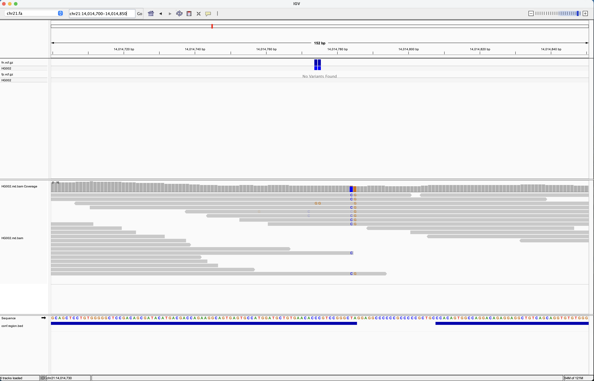
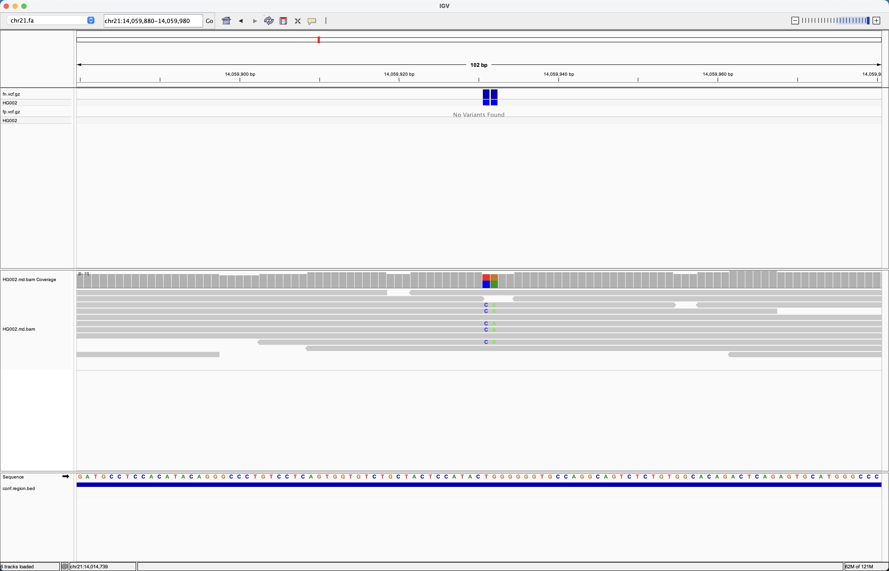
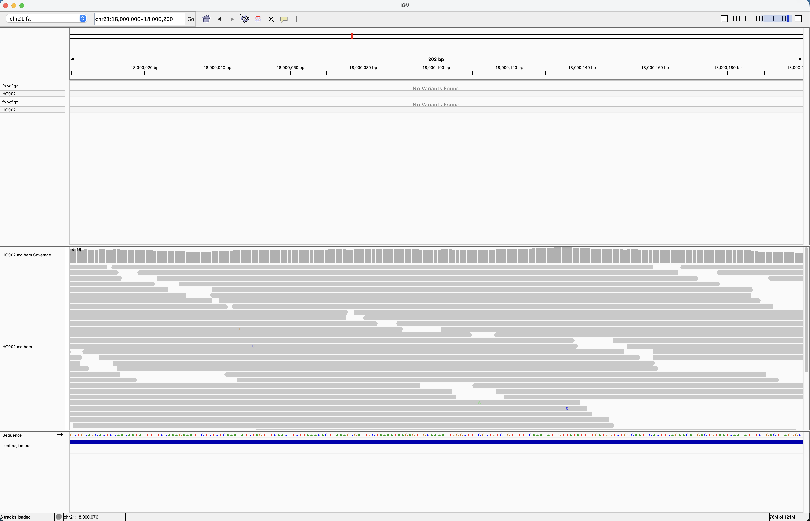

# バイオインフォマティクス学習ログ

臨床ゲノム解析（WGS/WES）のパイプライン構築を目指した学習記録。
公開データ（GIAB, 1000 Genomes）のみを使用し、患者由来データは一切扱わない。

## 環境
- MacBook Pro (Apple Silicon / macOS)
- Docker Desktop / Miniforge (conda, mamba) / Temurin JDK 17 / Nextflow 25.x

## Day 1 — 2026-09-17
- [x] Homebrew / Docker Desktop / Miniforge / JDK 17 / Nextflow のセットアップ
- [x] `nextflow run hello` 完走
- [x] `nf-core/sarek -r 3.10.0 -profile test,docker` 完走
- [x] MultiQC レポートを確認

### ハマった点

#### 1. Homebrew インストールが Xcode ライセンス未同意で中断
`You have not agreed to the Xcode license.` で停止。
→ `sudo xcodebuild -license` を実行し、スペースキーで本文を末尾までスクロール後、
`agree` とフルスペル入力する（`y` / `yes` では通らない）。

#### 2. Homebrew 本体は入ったが `brew update --force --quiet` で失敗
`Failed during: /opt/homebrew/bin/brew update --force --quiet` と表示されるが、
本体は `/opt/homebrew` に設置済みだった。`--quiet` を外して `brew update --force` を
再実行したところ `Already up-to-date.` で、一時的な失敗と判明。
→ 教訓：インストーラの最終ステップで落ちても、まず `brew --version` で本体の生存を確認する。
`--quiet` は原因を隠すので外して再実行する。

#### 3. Apple Silicon では Rosetta 設定が必須
Docker Desktop → Settings → General →
`Use Rosetta for x86/amd64 emulation on Apple Silicon` を有効化する。
バイオインフォ系のコンテナは大半が amd64 向けにしかビルドされておらず、
未設定だとパイプライン実行中に原因の分かりにくいエラーで停止する。
併せて `~/.nextflow/config` に以下を追加した。
docker.runOptions = '--platform=linux/amd64'

#### 4. Miniforge インストーラの初期化プロンプトの既定値が `no`
`Proceed with initialization? [yes|no]` で Enter だけ押すと `[no]` が採用され、
`conda` / `mamba` が PATH に入らない。
→ `yes` とフルスペルで入力する。

#### 5. Docker のホームディレクトリ共有警告がプロセスごとに表示される
Nextflow はプロセスごとに独立した `docker run` を発行するため、
`You have opted to share your home directory with a container` が繰り返し出る。
→ Docker Desktop の設定で当該通知を無効化する。
または作業ディレクトリをホーム配下の外（例：`/opt/bioinfo`）に置き、
Settings → Resources → File sharing に追加する。

#### 6. GitHub への push が `Invalid username or token` で失敗
Fine-grained token の `Only select repositories` に対象リポジトリが出てこなかった。
原因は GitHub 側にリポジトリを作成していなかったこと。
`git remote add` はローカルに送信先を記録するだけで、リモートのリポジトリは作られない。
→ 先に GitHub 上でリポジトリを作成してから、トークンのスコープに追加する。
または `gh repo create <name> --public --source=. --push` で一括処理する方が早い。

## 次の予定
- GIAB HG002 (chr21) を用いた FASTQ → BAM → VCF の手動実行
- `hap.py` によるベンチマーク（recall / precision の測定）

## Day 2 — GIAB HG002 を用いた手動パイプラインとベンチマーク
対象: GRCh38 chr21:14,000,000-24,000,000（約10 Mb）、約30x に間引き
FASTQ → bwa mem → samtools sort → GATK MarkDuplicates
→ GATK HaplotypeCaller → VariantFiltration → rtg vcfeval

### 結果（GIAB v4.2.1 信頼領域内、PASS コール）

| | Precision | Sensitivity | F-measure | FP | FN |
|---|---|---|---|---|---|
| SNP | 0.9995 | 0.9905 | 0.9950 | 7 | 132 |
| INDEL | 0.9933 | 0.9776 | 0.9854 | 16 | 54 |

### 考察
- フィルタ前の INDEL 数（3,644）は SNP の約24%と、ゲノム全体の目安（約15%）より多かった。
  偽陽性過多を疑ったが、信頼領域内の INDEL precision は 99.3% で偽陽性は少なかった。
  評価対象になった INDEL は約2,370件で、残り約1,200件は GIAB の信頼領域外
  （反復配列・セントロメア近傍など）にあり、本ベンチマークでは正誤を判定できない。
- 上記の数値は「信頼領域内・10 Mb 窓」での成績であり、全ゲノムの精度を示すものではない。
- 重複率は 0.23% と低く出たが、1/10 ダウンサンプリング後の値であり、
  重複ペアの両方が残る確率が約1%に下がるため過小評価されている。
  ライブラリ品質の指標としては使えない（QC は間引き前に取るべき）。

### 今回の簡略化・限界
- リファレンスを chr21 のみに限定（他領域由来リードの誤マップを許容する学習上の割り切り）
- 元データは novoalign + decoy 入り GRCh38（`GRCh38_full_plus_hs38d1_analysis_set_minus_alts`）、
  再解析は bwa + GIAB no_alt analysis set の chr21 のみ。再アライメントで 0.3% がアンマップに
- BQSR 未実施
- ハードフィルタは SNP / INDEL を分離せず単一閾値
- 複数ライブラリ由来のリードを単一の LB に統合（MarkDuplicates の判定に影響しうる）
- Apple Silicon のため bwa-mem2 ではなく bwa を使用（Rosetta は AVX 非対応）

### ハマった点
- ターミナルが bash だったため、`~/.zshrc` に書いた PATH が読まれず `nextflow: command not found`。
  `chsh -s /bin/zsh` で zsh に統一し、`conda init zsh` で conda を再初期化
- 別タブは作業ディレクトリと conda 環境を引き継がない。
  タブを開いたら `conda activate wgs && cd ~/bioinfo/day2` を最初に実行する
- リモート BAM の領域抽出サイズを事前に見積もれなかった（300x × 10 Mb で約 1.8 GB）
- リモート BAM から抽出したファイルは `samtools quickcheck` で完全性を確認する
## Day 3 — 見逃しの原因分析と、フィルタ・BQSR の効果比較
対象は Day 2 と同じ（HG002、GRCh38 chr21:14,000,000-24,000,000、約30x）。

### 目的
1. Day 2 のパイプラインが「なぜ見逃したのか」を、数字と目視で突き止める
2. フィルタと BQSR を変えたとき、精度がどう動くかを定量的に比較する

### 比較の設計（1変数ずつ変更）
| 条件 | BQSR | フィルタ |
|---|---|---|
| A | なし | 簡略版（SNP / INDEL 共通の閾値） |
| B | なし | GATK 推奨のハードフィルタ（SNP / INDEL 分離） |
| C | あり | GATK 推奨のハードフィルタ（SNP / INDEL 分離） |

A→B の差がフィルタの効果、B→C の差が BQSR の効果。

### 結果（GIAB v4.2.1 信頼領域内、PASS コール）
| 条件 | 種類 | Precision | Sensitivity | F-measure | FP | FN |
|---|---|---|---|---|---|---|
| A | SNP | 0.9995 | 0.9900 | 0.9947 | 7 | 139 |
| B | SNP | 0.9995 | 0.9900 | 0.9947 | 7 | 139 |
| C | SNP | 0.9993 | 0.9902 | 0.9948 | 9 | 136 |
| A | INDEL | 0.9932 | 0.9747 | 0.9839 | 16 | 61 |
| B | INDEL | 0.9933 | 0.9838 | 0.9885 | 16 | 39 |
| C | INDEL | 0.9941 | 0.9855 | 0.9898 | 14 | 35 |

生データ: `day3/comparison.txt`

### 考察

**A→B（フィルタの分離）**
- INDEL の見逃しが 61 → 39 に減少（22件回復）。偽陽性は 16 のまま増えなかった。
- 回復した22件は、条件 A で SOR > 3（21件）と MQ < 40（1件）により除外されていた
  （`day3/indel_recovered_filters.txt`）。差分を1件残らず説明できた。
- INDEL はホモポリマーや繰り返し配列の近くに多く、リード端のソフトクリップが片方の向きで
  起きやすいため、本物でも見かけ上のストランドバイアスが出る。SNP 用の SOR 閾値を
  INDEL に流用したことが原因。
- SNP は変化なし。条件 A・B とも SNP には同じ SOR > 3 と MQ < 40 を適用しており、
  B で追加したフィルタ（QUAL、MQRankSum、ReadPosRankSum）は信頼領域内の結果を1件も変えなかった。

**B→C（BQSR）**
- SNP は FN −3 / FP +2、INDEL は FN −4 / FP −2。
- 約13,900件の SNP 正解に対して数件の差であり、1サンプル・10 Mb のデータで
  「BQSR により改善した」と主張できる大きさではない。
- 近年の Illumina データは装置側の品質値が既に比較的正確で、補正の余地が小さいことが
  一因と考えられる。

**注：条件 A の数字が Day 2 と異なる理由**
- `gatk SelectVariants` は、SNP と INDEL が同居する複合サイトをどちらにも含めない。
  Day 2 は `bcftools view -v` で分割していたため、その分（SNP / INDEL 各7件）が差として出た。
  比較条件を揃えるため、全条件を同じ方法で分割し直した。

### SNP 見逃し（FN）の分析
Day 2 の SNP 見逃し132件を分類した（`day3/fn_triage.txt`）。

| 分類 | 件数 |
|---|---|
| コールされたが SOR > 3 で除外（MQ < 40 との重複1件を含む） | 88 |
| コールされたが MQ < 40 で除外（同上） | 19 |
| コールされたが QD < 2 で除外 | 1 |
| PASS だが正解と不一致 | 3 |
| 未コール | 22 |

- **132件中110件はコールされており、フィルタで除外されていた。** 主因は SOR > 3（88件）。
- 条件 A・B・C で SNP の見逃しがほぼ変わらなかったのは、3条件とも SNP に同じ SOR / MQ 閾値を
  適用していたため。SNP の SOR 閾値の見直しが次の検証課題。
- 未コール22件の地点の平均深度は 14.9（領域全体は 30.9）。MAPQ 20 以上に絞っても 14.9 のまま
  変わらないため、置き場所が曖昧なリードの問題ではなく、リードそのものが不足している。
- 見逃しの位置は領域全体に分布していた（1 Mb あたり 2〜25件、最多は 18 Mb）。

#### 事例1：chr21:14,059,931–932（フィルタ落ち）
- 深度約11。約半数のリードに2つの変異が必ずセットで乗る、本物のヘテロ接合（MNP）。
- MQ < 40 のフィルタで除外されていた。フィルタが本物を捨てた例であり、
  感度と精度のトレードオフの実例。

#### 事例2：chr21:14,014,774–775（未コール）
- 手元の 30x では、変異塩基を持つリードが1本のみ。
- 元の 300x BAM を pileup で確認すると、変異リードは 127本中6本（約4.7%）で、
  しかも6本すべてが逆鎖だった（`day3/pileup_300x_chr21_14014774.txt`）。
- ヘテロ接合なら約50%が期待される。深度も期待値の約4割しかない。
  変異側の染色体に由来するリードの大半が、元のアライメントの段階で別の場所に置かれたと推定。
- 300x で6本 → 10% 間引きの期待値は約0.6本 → 観測1本、で整合する。
  領域抽出・間引き・再アライメントのいずれでも取りこぼしていない。
- 約10 bp 隣の 784–785 はほぼ100%が変異（ホモ接合）で、正しくコールできていた。
- 直後の約20 bp は GIAB 信頼領域から除外された GC リッチ配列。
- 結論：短いリードでは原理的に見えにくい変異。パイプライン改善の対象ではなく、
  臨床レポートでは「検出できない領域」として限界に明記すべきもの。

### 途中で誤った判断と、その訂正
- IGV で確認する地点を、座標順に並んだファイルの先頭5行から選んだため、すべて 14 Mb 付近になった。
  それを見て「見逃しは 14 Mb に集中している」と判断したが、全件を集計すると領域全体に分布していた。
- 条件 A・B・C で SNP の見逃しが変わらなかったことを「フィルタでは回復しない下限」と解釈したが、
  実際には3条件とも SNP に同じ SOR / MQ 閾値を当てていただけだった。全件の分類で、
  110件がフィルタ除外であることが判明した。
- 教訓：並べ替え済みファイルの先頭だけで偏りを判断しない。条件を変えていない部分の結果が
  変わらないことを、結論の根拠にしない。個別事例を見る前に、まず全件を集計する。

### 学んだこと
- 数字が改善しても、差が小さければ「改善した」とは主張できない。
- Best Practices に含まれる処理でも、データによって効果は大きく異なる。
- フィルタの閾値は変異の種類ごとに意味が違う。流用すると本物を捨てる。
- 短いリードの WGS には原理的に見えにくい変異がある（事例2）。ただし今回の SNP 見逃しの
  大半はフィルタ由来であり、データの限界と言えるのは未コールの一部に留まる。
- 仮説は必ず別のデータや全件集計で検証する。

### 今回の簡略化・限界
- 対象は1サンプル・10 Mb のみ。結果を全ゲノムや他サンプルに一般化できない。
- BQSR の既知変異（dbSNP、Mills、known indels）は対象領域周辺のみを使用。
- フィルタは GATK 推奨のハードフィルタのみで、VQSR は未検討。
- Day 2 の限界（chr21 のみのリファレンス、間引きによる重複率の過小評価など）は引き続き有効。

### 使用したスクリプト
- `day3/bqsr_call.sh`：BaseRecalibrator → ApplyBQSR → HaplotypeCaller
- `day3/filter_split.sh`：SNP / INDEL を分けて GATK 推奨のハードフィルタを適用
- `day3/eval.sh`：rtg vcfeval で SNP / INDEL 別に採点

いずれも `set -euo pipefail` により、途中のコマンドが失敗した時点で停止する。

### ハマった点
- IGV 起動時に `Unsupported major.minor version 65.0`。65.0 は Java 21 を意味し、
  IGV は Java 21 を要求するがシステムには Java 17 しかなかった。
  `brew install --cask temurin@21` で解決。GATK は conda 環境内の Java 17 を使うため影響なし。
- BED は0始まり、VCF と IGV は1始まり。BED の座標をそのまま IGV に入れると1塩基ずれる。
- zsh はワイルドカードに一致するファイルが無いと `no matches found` でエラーにする（bash は文字列をそのまま渡す）。

### 次の予定
- 条件 D の効果を、閾値の決定に使っていない別の領域で検証する
- Day 1〜3 の手作業を Nextflow のパイプラインに書き直す（ポートフォリオ `wgs-germline-nf` の原型）

### IGV スクリーンショット
事例2（未コール、変異リードがほぼ存在しない）

事例1（MQ40 で除外された本物のヘテロ接合 MNP）

比較用の正常な場所（深度約38x、エラーは縦に揃わない）

### 追加検証：SNP の SOR フィルタを外す（条件 D）
条件 B から、SNP の SOR > 3 だけを外した。INDEL は B と同一。

| 条件 | Precision | Sensitivity | F-measure | FP | FN |
|---|---|---|---|---|---|
| B（SNP） | 0.9995 | 0.9900 | 0.9947 | 7 | 139 |
| D（SNP） | 0.9994 | 0.9963 | 0.9978 | 9 | 52 |

- 見逃しが 87件減り、偽陽性は 2件増えただけだった。
- 見逃し分類で SOR3 による除外は88件、うち1件は MQ40 でも除外されていたため、
  回復の期待値は87件。観測値と一致した。
- 残った52件の内訳：MQ40 除外 19、QD2 除外 1、PASS だが遺伝子型不一致 3、未コール 22、
  複合サイトの評価上の除外 7。見逃しの増減を1件単位で説明できた。
- 事前の予想（FN 約10件減、FP 約20件増）は大きく外れた。見逃し分類の結果（SOR3 で88件）から
  定量的に予想できたはずだった。

**注意：この改善は楽観的な見積もりの可能性がある。**
閾値を決めた領域と評価した領域が同じため、この10 Mb に過剰に合わせた結果かもしれない。
別の領域・別のサンプルで同じ効果が出るかを確認するまで、「SOR > 3 は SNP に不適切」とは主張できない。
現時点で言えるのは、推奨値をそのまま使わず、自分のデータで正解セットに対して較正する必要がある、ということ。
